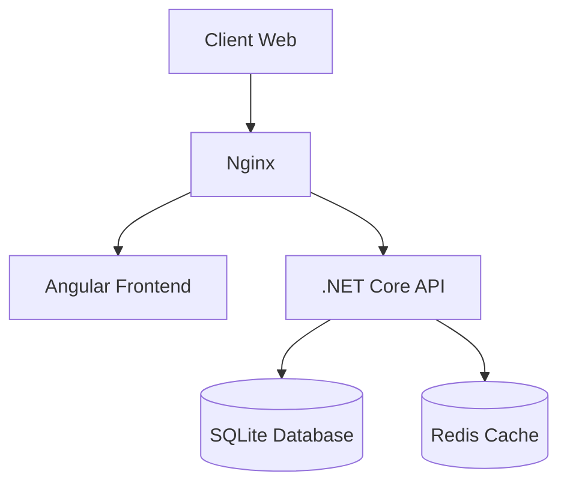
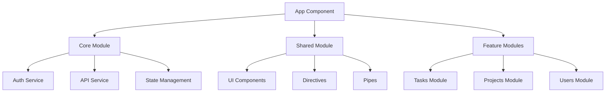
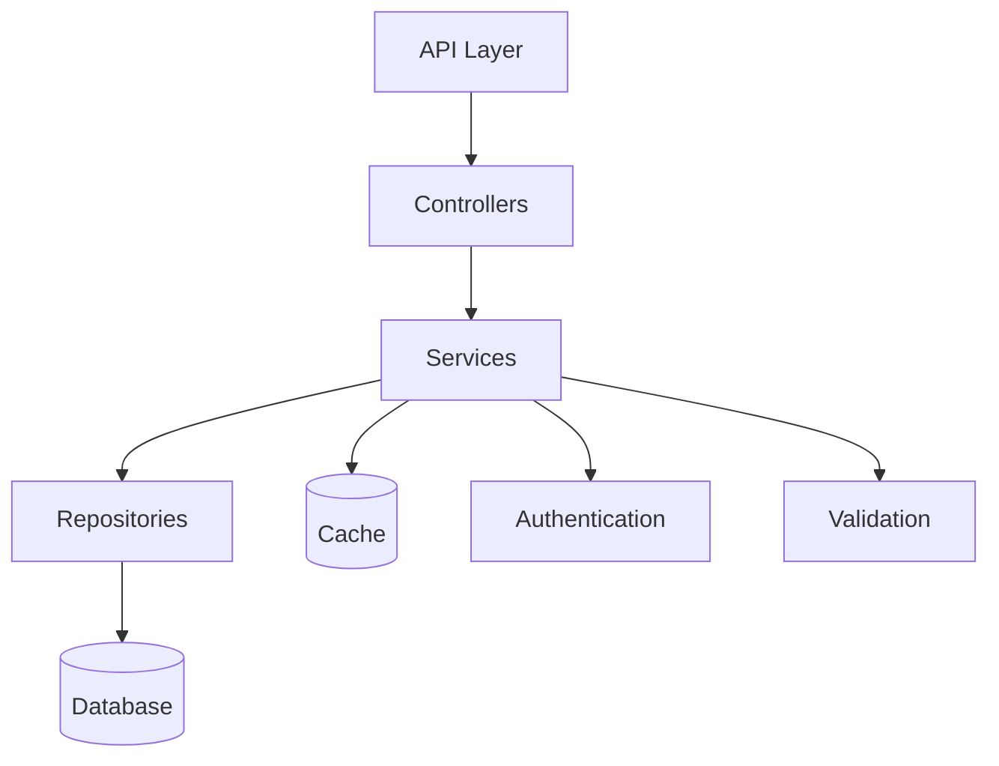
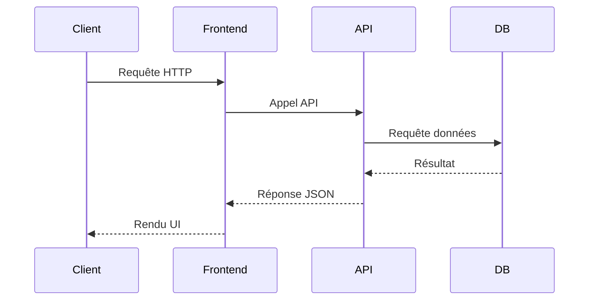
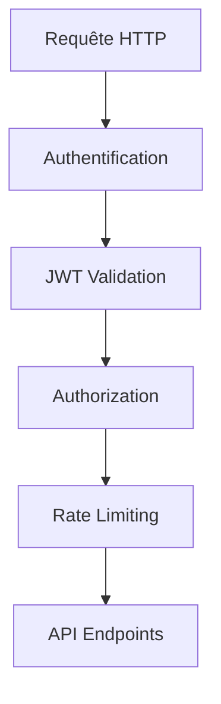
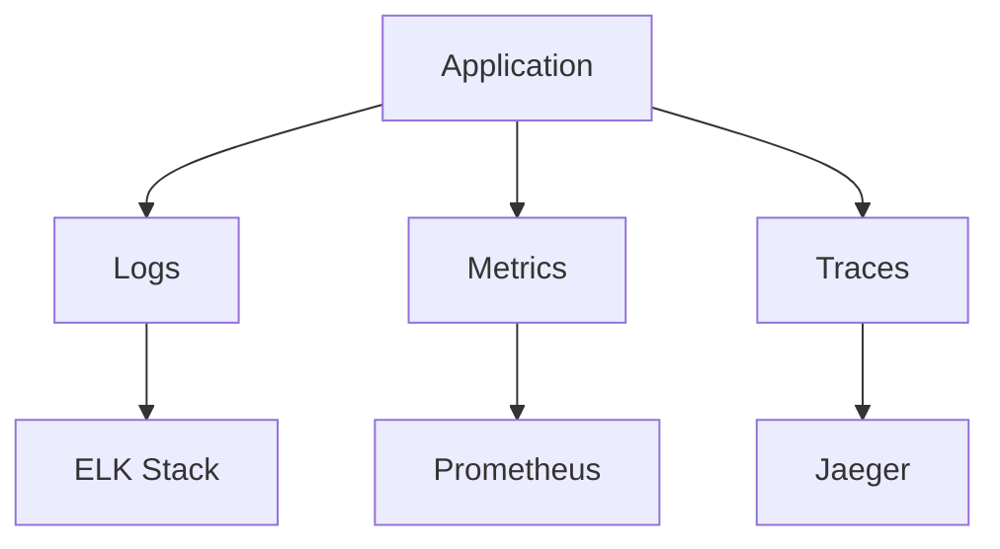
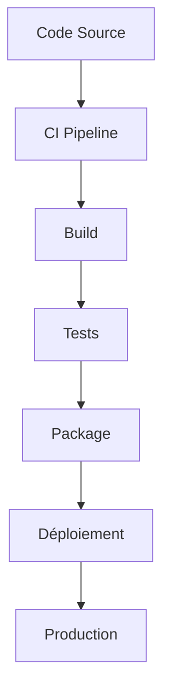

# Architecture du Task Manager

## Vue d'ensemble

Le Task Manager est une application moderne construite avec une architecture microservices, utilisant Angular pour le frontend et .NET Core pour le backend.

## Architecture système

## Architecture Frontend

## Architecture Backend

## Flux de données

## Composants principaux

### Frontend (Angular)

1. **Core Module**
   - Services d'authentification
   - Intercepteurs HTTP
   - Guards
   - State management

2. **Shared Module**
   - Composants réutilisables
   - Directives communes
   - Pipes de formatage
   - Modèles de données

3. **Feature Modules**
   - Gestion des tâches
   - Gestion des projets
   - Gestion des utilisateurs

### Backend (.NET Core)

1. **Controllers**
   - Gestion des routes
   - Validation des requêtes
   - Formatage des réponses

2. **Services**
   - Logique métier
   - Gestion du cache
   - Validation des données

3. **Repositories**
   - Accès aux données
   - Requêtes optimisées
   - Transactions

## Sécurité

## Performance

1. **Caching**
   - Redis pour le cache distribué
   - Cache en mémoire pour les données fréquentes
   - Cache des assets statiques

2. **Optimisations**
   - Lazy loading des modules
   - Compression des réponses
   - Pagination des résultats

## Monitoring

## Déploiement

## Évolutions futures

1. **Microservices**
   - Séparation des services
   - Communication via message broker
   - Scaling indépendant

2. **Cloud Native**
   - Conteneurisation complète
   - Orchestration Kubernetes
   - Service mesh

3. **Observabilité**
   - Distributed tracing
   - Métriques détaillées
   - Alerting automatisé 